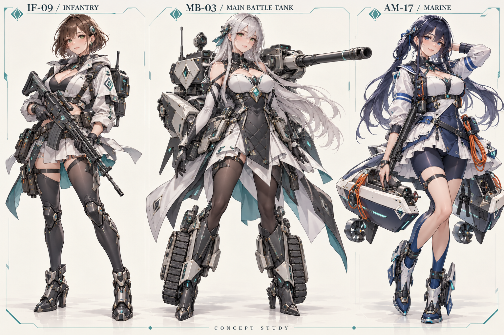
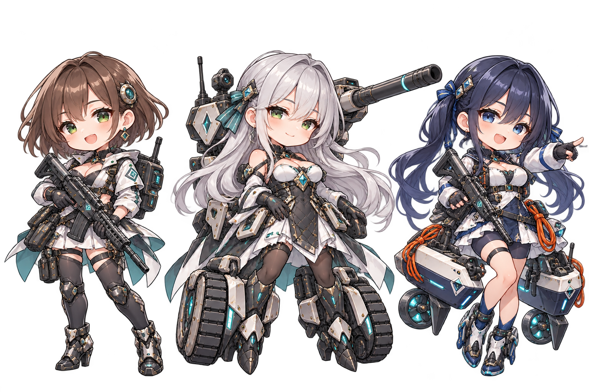

# 美少女单位与双版本美术规格

日期：2026-10-09。关联 FB-20261009-002。状态：设计提案与概念验证；三十八型号尚未全部绘制或接入。
世界观：[六域：雾海回响](机装少女世界观与背景故事-2026-10-09.md)。

## 1. 确定的方向

所有可生产战斗单位采用美少女角色形象，包括步兵、坦克、炮兵、防空、舰船、侦察机、战斗机、轰炸机与特殊单位。人物统一为明确成年女性，个体身份与机装型号分开。旧六位剧情 NPC 的肖像不是本次资源制作重点。

一套角色同时制作两个版本：

| 版本 | 风格与用途 | 必须保留 |
| --- | --- | --- |
| 完整立绘 | 精美二次元插画；用于图鉴、单位详情、生产预览、宣传 | 精致脸部、不同发型与体态、服装层次、机装材质、完整人物与装备 |
| Q 版棋子 | 约 2.5—3 头身；用于棋盘行走与战斗 | 相同发色、主色、饰扣和核心武装；在小尺寸清楚表达兵种 |
| UI 头像 | 从批准的立绘另行裁切，用于列表与简报 | 面部可见，裁切统一；不代替棋盘兵种标记 |

角色美感是核心，战斗信息也要能直接辨认。不能只换颜色制作三十八个相同剪影，也不能把立绘缩成几十像素就当成 Q 版。

### 美术语言

- 通用风格：原创二次元面部、清楚线稿与精细厚涂／赛璐璐结合，服装有裁剪、饰扣和面料区分。整体明亮但保留金属与战斗装备的重量感。
- 轻装：短外套、轻裙甲、枪械与小背包；身体和服装有较多留白。
- 装甲：菱形／矩形甲片、履带和固定主炮；重型号扩大机装体量而不简单放大人物。
- 海军：蓝白制服、条纹、浮力平台、舰桥与炮塔；登陆少女和大型舰炮少女分开。
- 航空：翼形、发动机数量、载荷和光学设备主导剪影，围巾或裙摆不能取代实际机翼。
- 支援：工具、机械臂、天线、发射器与支架，体现特有功能。
- 人格倾向帮助姿态和表情设计；同型号个体可以有不同性格，不设定为一套没有差异的复制人格。

## 2. 首批概念验证

已通过内置 image_gen 生成两张 1536×1024 概念板，均为三名型号代表。完整提示词见[生成记录](../assets/concept/anime-unit-generation-2026-10-09.md)。

| 型号 | 立绘身份与主要识别点 | Q 版对应 |
| --- | --- | --- |
| IF-09 前哨 | 栗棕短发、青绿眼、轻外套、步枪、携行背包；轻装守备 | 最小装备体量，短枪与背包，紧凑竖直剪影 |
| MB-03 棱镜 | 银灰长发、菱形护甲、单主炮、对称履带机装；稳健推进 | 放大履带与菱形甲，固定炮架，宽于前哨 |
| AM-17 浪锋 | 蓝黑双束长发、蓝白海军服、小型步枪、救生绳、轻艇浮力模块 | V 形舟装与蓝条纹，区别于普通步兵和主炮舰 |

姓名可在正式档案阶段另定；这里使用型号呼号，避免把一种可量产部队误写为唯一剧情人物。

检查结果：立绘 PNG 为 RGB；Q 版 PNG 为 RGBA，角点与顶部空白区域 alpha 为 0。已检查三类角色的发色、机装与配色对应。Q 版仍有细密材质与柔边阴影，正式棋盘素材需进一步减细节、分离单角色、清理透明边缘并验证小尺寸识别。这两张是评审概念图，不是完整动画图集，不代表游戏画面已更新。

## 3. 全三十八型号设计方向

数据对应当前 `src/data.js` 的三十八单位。名称可以作为机装呼号；ID 和已有规则可在首阶段保持，外形与背景允许重构。以下全为成年女性机装少女，年龄与个体姓名留到正式角色档案阶段。

| 单位 ID／呼号 | 人物气质与精美立绘识别点 | Q 版核心轮廓 | 必须表达的战术特性 |
| --- | --- | --- | --- |
| `infantry` 前哨 | 温和警觉；栗棕短发、轻外套、双环扣、步枪与背包 | 轻身、单枪、小背包 | 低成本守备、免战略能源、城市驻守；不两栖 |
| `walker` 哨兵 | 干练；短披肩、识别肩章、短枪与折叠掩体 | 比前哨更宽的肩部、掩体板 | 突击、构筑掩体；不两栖 |
| `heavyinfantry` 壁垒 | 可靠；厚肩甲、层叠裙甲、前置防护盾 | 大盾、宽肩、低重心 | 重步兵承伤、低机动；不冒充反坦克兵 |
| `lighttank` 雨燕 | 活泼；燕尾外套、薄甲、短炮 | 窄履带、小炮塔 | 快速轻装甲、低能耗、不可入海 |
| `tank` 棱镜 | 冷静；银发、菱形胸肩甲、单根中长炮 | 中型履带、菱形、单主炮 | 主战推进、穿甲弹；不可入海 |
| `heavy` 磐石 | 坚毅；厚矩形装甲、宽裙甲、双炮口 | 最宽地面履带、双炮 | 重攻坚、低机动、锚定防线 |
| `lightartillery` 火萤 | 专注；短披肩、轻轮架、单炮与双支撑脚 | 轻炮架、短炮 | 间接火力、近距盲区；移动后不攻击、不反击 |
| `artillery` 弧光 | 有条理；弧形裙摆、抬升短粗炮、四支撑 | 抬升炮管、宽腰炮架 | 中程间接火力、震荡弹；移动后不攻击 |
| `heavyartillery` 雷砧 | 寡言；长外套、长重炮、四角支架 | 超长炮、厚履带、支撑脚 | 远程炮击、近距盲区；移动后不攻击 |
| `antiair` 天幕 | 警觉；圆雷达饰件、四联炮、轻履带 | 四炮点、圆雷达 | 基础对空、受直接攻击后的强化反击 |
| `missileaa` 穹盾 | 严谨；双导弹箱、雷达盘、中型机甲 | 两个方导弹箱 | 导弹防空、强化反击；没有自动替友军拦截 |
| `longrangeaa` 星垒 | 沉着；四导弹箱、大型雷达背冠 | 高雷达、四箱、宽甲 | 远程防空、低机动；范围不表示自动保护圈 |
| `navaldestroyer` 潮刃 | 爽朗；窄海军外套、细舰装、双小炮塔 | 细长舰体、双炮 | 快速海上护航、常规对空；仅海洋 |
| `cruiser` 巡岚 | 自信；宽长舰装、三炮塔、高舰桥 | 中宽舰装、高桥 | 海上主战、兼顾对空；仅海洋 |
| `battleship` 镇海 | 威严；层叠长裙舰甲、三座双联主炮 | 最宽舰装、多主炮 | 远程舰炮、不对空、不反击；现规则允许移动后攻击 |
| `marine` 浪锋 | 果断；蓝白短外套、救生绳、轻艇模块 | 轻艇 V 形、短枪 | 两栖、免战略能源、登陆占领；海上脆弱 |
| `assaultmarine` 破浪 | 勇敢；短海军披肩、突击枪、编队扣 | 较宽轻艇、突击枪 | 两栖突击，较浪锋更强火力和防护 |
| `heavymarine` 礁盾 | 耐心；厚海军护甲、前盾、宽登陆装 | 盾与宽艇体 | 两栖重步兵、低机动；仍需舰队掩护 |
| `aafrigate` 云帆 | 细心；帆形短披肩、单防空炮与圆雷达 | 窄舰、雷达、对空炮 | 海上防空、强化反击、对舰地弱 |
| `aamissileship` 海幕 | 负责；双导弹舰装、高雷达肩架 | 双导弹阵列、中舰体 | 中程舰队防空；仅海洋，无自动拦截 |
| `areaaship` 穹海 | 庄重；四片舰甲裙、大型相控阵 | 大雷达、四阵列、宽舰 | 远程海上防空、高能耗、对舰弱 |
| `reconplane` 纸鸢 | 好奇；轻飞行服、窄长翼、观察镜 | 细长翼、小光学镜 | 空中侦察、扫描、低火力；不能对空或反击 |
| `tacticalrecon` 望隼 | 理性；双尾披肩、长翼、大观察镜 | 长翼、双尾、大镜头 | 更广视野、更远机动；扫描、低火力 |
| `longrangerecon` 天眼 | 敏锐；长外套、超长翼、双引擎与传感器 | 最长翼、双引擎 | 纵深侦察、最高侦察视野；扫描 |
| `lightfighter` 青隼 | 好胜；短夹克、窄后掠翼、单引擎 | 窄后掠翼、小机装 | 轻型制空、可反击；地海弱 |
| `fighter` 苍隼 | 果断；完整飞行甲、标准后掠翼与单尾 | 标准翼、单尾、稳定中型轮廓 | 主力制空、高于轻型的投入 |
| `heavyfighter` 霄刃 | 冷峻；厚飞行甲、宽翼、双引擎双尾 | 宽后掠翼、双尾 | 重型护航、强对空、高能耗 |
| `lightbomber` 鸣雷 | 明快；短平直翼、双引擎、小载荷舱 | 短直翼、小弹舱 | 近程对地海；不能对空或反击 |
| `tacticalbomber` 惊雷 | 利落；宽平直翼、双尾、中型载荷 | 宽直翼、双引擎 | 战术轰炸；不能对空或反击 |
| `bomber` 远雷 | 坚韧；大载荷背架、宽直翼、四引擎 | 四引擎、大弹舱 | 远程轰炸、高能耗；不能对空或反击 |
| `scout` 游隼 | 健谈；短轻装、轮式模块、环形天线 | 四外露轮、环天线 | 地面高速侦察与扫描；不同于空中侦察 |
| `engineer` 织补 | 细致；工具腰带、方背舱、双机械臂 | 双维修臂、工具箱、大十字 | 相邻修复、弱攻击、不反击；不复活退场单位 |
| `antitank` 猎矛 | 耐心；守备服、肩扛发射器、小三脚架 | 大肩筒、轻身体 | 反装甲、静止伏击、免战略能源 |
| `jammer` 脉冲 | 灵巧；圆弧披肩、干扰盘、三天线 | 圆盘、三天线、稳定臂 | 短时 AP 干扰、受视野与射线限制 |
| `destroyer` 长钉 | 专注；窄长衣摆、低重心机甲、超长直射炮 | 单超长炮、低履带 | 反装甲直射、定点狙击；区别于间接炮兵 |
| `amphibious` 涉潮 | 随和；短炮塔、轻履带、浮力侧舱 | 小炮与双浮舱、两种工作姿态 | 两栖轻装甲；海上能源成本更高 |
| `submarine` 潜锋 | 安静；流线舰装、低围壳、鱼雷模块 | 胶囊形、无主炮塔 | 海上反舰；当前无隐身或独立潜航层 |
| `helicopter` 蜂鸟 | 活泼；轻飞行裙甲、旋翼背装、尾桨 | 十字旋翼、窄身、外挂 | 对地海轻型支援；不能攻击空军 |

## 4. 资源交付规格

建议源文件为分层可编辑格式，PNG 是交付格式之一。尺寸是开发评审起点，需要与实际界面占用、内存和包体一起确认。

| 资源 | 建议规格 | 说明 |
| --- | --- | --- |
| 主立绘 | 每型号一张，透明 PNG，长边约 2048px；保留人物、机装、表情的源图层 | 38 张主立绘；UI 小图另外导出，避免载入原图再缩小 |
| Q 版基础形象 | 每型号一套，透明画布建议 256×256 或 320×320 | 38 套；统一脚底锚点和摄像机方向，超长武装另做受控边界 |
| UI 头像与列表图 | 128／256px 两档，统一裁切 | 从批准角色源图制作；图鉴完整图按需加载 |
| 陆海状态 | 浪锋、破浪、礁盾、涉潮分别提供陆地／海洋工作姿态 | 角色身份一致；水上有浮力模块，陆地收拢 |
| 阵营识别 | 青绿圆环／珊瑚红三角；2—6 方叠加独立席位色与序号 | 不必重复绘制 76 张大立绘；保留颜色之外的徽记 |
| 动作状态 | 待机、移动、攻击、技能、受击、退场 | 前期可由独立人物／武器图层和代码动画实现；不把一张概念板当成全部状态 |

正式交付的三十八套含双形态及状态的制作量高于“38 张图片”。优先取得批准的三型号双版本，再估算同体系三级变体、海军与空军机装的单项工作量。没有人员、源图质量和动作方案前，不承诺总工期或费用。

## 5. 游戏接入建议

首阶段可保留单位 ID、技能、数值与快照字段，加入独立资源登记，例如由 `unitId` 查找 portrait、avatar、chibi、海陆姿态及图层锚点。型号名可以保留，个体姓名不成为读取存档的键。

关键入口：

- `src/art.js` 的 `unitMarkup`／`unitSvg` 目前直接生成单位 SVG，棋盘并不自动读取导出的 PNG。Q 版必须接入此渲染链，保留兵种、阵营、HP、AP、等级、范围与层级。
- `src/battle-ui.js` 与 `src/fx.js` 要共享锚点、单元尺寸和动作图层，避免大头、炮管遮挡相邻格子与点击。
- `src/ui.js` 的图鉴、生产预览和选中面板可展示立绘／头像；旧剧情姓名肖像映射需要在剧情重写时另行更新。
- `scripts/export-portraits.js` 会覆盖旧六人 SVG，占位与正式单位资源应使用不同目录；正式源资源不能被导出脚本重绘覆盖。
- `src/data.js` 是三十八型号的规则核对入口。静态资源和显示名称可独立升级，不将新美术描述偷偷转成新能力。
- `src/content.js` 来自内容构建；新世界正式上线前，应更新正式对白与配置来源，再构建运行内容，避免只改生成文件。

文件访问、离线打开与本地服务器两种模式都要验证资源路径。图鉴按需加载立绘，棋盘只加载本局所需 Q 版／缩略资源；不在每次选择时下载所有原尺寸人物图。

## 6. 验收与阶段

1. 方向验证：当前三型号概念板用于评审脸部、服装、机装与 Q 版一致性；完成单角色切图、战场组合预览与最小 UI 样页后，才确认量产画法。
2. 陆军批次：覆盖四个常规陆军体系及地面特殊单位，重点比较步兵、主战、炮兵、防空、侦察与工程的剪影。
3. 海空批次：完成所有剩余型号与海陆状态，重点测试舰炮、防空舰、侦察机、战斗机和轰炸机差异。
4. 世界统一：改写七章对白与地点美术，更新图鉴、标题氛围和宣传素材，做资源／规则／旧存档回归。

美术检查：

- 同一型号立绘与 Q 版的发色、饰扣、服装主色与主武装一致；不同型号至少有三个稳定差异点。
- 在实际棋盘缩放和手机屏幕上测试；建议 64—96px 的棋子展示区仍能识别大类兵种。远景改用徽记，不靠微小细节。
- 无名称辨识试测：招募熟悉与不熟悉本作的玩家各一组，先测三种样本，再测完整体系；记录类别判断正确率和常见混淆对。目标可先定大类 ≥90%，这是待验证目标。
- 透明边缘无背景块；脚底锚点、武装边界与海陆姿态一致。阵营、行动状态与范围标记在角色上层清晰可见。
- 性能以 v0.9 同设备基线对比首屏、图鉴切换、内存与平移响应；完成一次测量再确定包体预算。
- 规则检查包括隐藏目标、反击、地面炮兵移动限制、镇海移动后攻击、自动部署与旧存档。换成少女形象不改变目标权限。

营销内容可学习官方展示中的“角色档案＋职业身份＋世界设定”组织方式，例如[明日方舟官方网站](https://ak.hypergryph.com/)确实同时展示人物档案与设定。这里仅借鉴信息组织原则；本提案角色与机装均为原创，也没有把任何作品的商业成绩作为改版收益依据。
